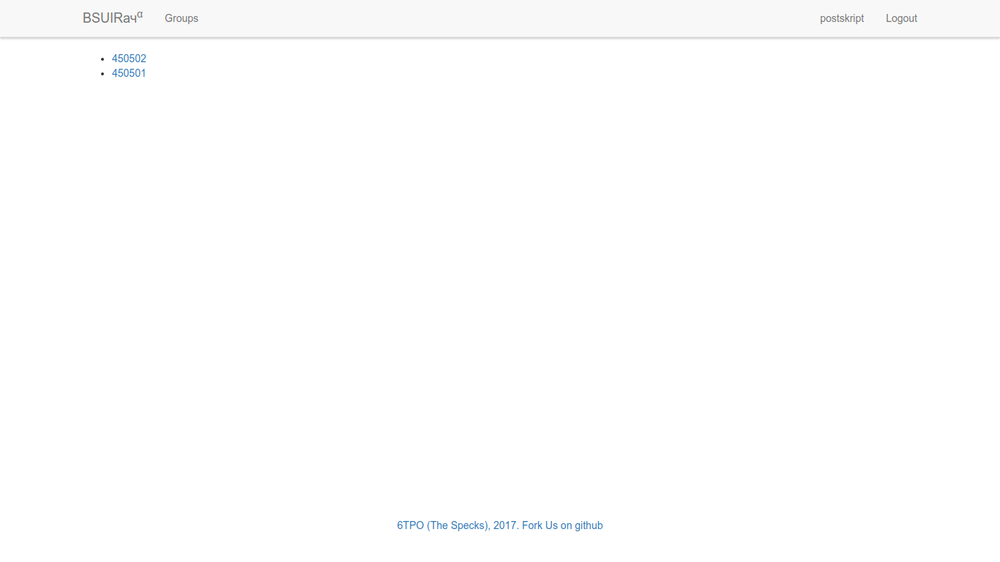
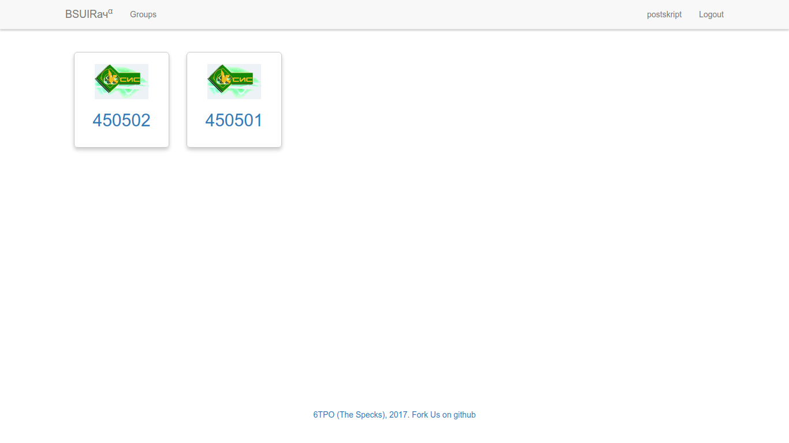

# Лабораторная работа 6: Улучшение UX

## Оценка ПО по атрибутам

1. Распознаваемость соответствия

На главной странице находится контент, напрямую связанный с основной целью 
существования продукта, т.е. его неотъемлемая часть. Пользователь быстро 
понимает, что за продукт перед ним.

2. Обучаемость

В интерфейсе используются общепринятые принципы использования, таким образом,
пользователю практически не нужно обучаться пользованию продуктом.

3. Используемость (операбельность)

Фото в галерее о преподавателе можно легко открыть в большем масштабе без 
открытия новой вкладки (открывается в модальном окне), фото так же легко 
возвращается к прежнему виду. Однако, при добавлении тегов отсутствует 
автодополнение, что усложняет ввод и является минусом.

4. Защита от ошибок пользователя

В случае неудачной авторизации пользователь видит сообщение, что данные были 
введены неверно.

5. Эстетика GUI

UI достаточно прост, однако выдержан в едином стиле, без элементов, не 
оправдывающих своё наличие. Тем не менее, страница со списком групп недоработана:
состоит только из простого списка, что смотрится так, будто дизайнер забыл 
сверстать страницу, а программист сумел поставить только базовые элементы.

6. Доступность

Продуктом при желании можно пользоваться без мыши - табами либо с помощью 
cvim/vimperator, т.к. сайт не переопределяет работу клавиш. Присутствует 
альтернативный текст в изображениях, javascript используется минимально. 
CAPTCHA/Flash/Java не используется. Однако, отсутствует версия для слабовидящих.

## Пути улучшения

Изменить вид списка групп, сделать его красивым. По элементу списка должно быть
видно, к какому факультету относится группа. Так страница станет более удобной
и понятной для использования.

Было:

Стало:

